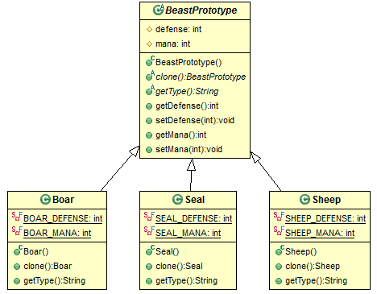
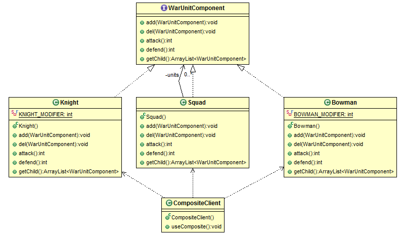
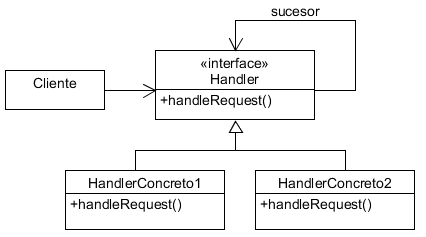

# UML 

### Acceso
- \- private
- \# protected
- \+ public

### Dependencia
- Con la flecha de una clase a otra indicamos una dependencia.
- linea continua con flecha, es un atributo 
- linea discontinua con flecha, es un método

### Agregación / Composición
- A un avión agregamos un piloto y esta compuesto de alas
- Significa que una clase forma parte de otra
- Generalmente se ha representado como una flecha.

### Herencia
- Se representa entre dos clases con una flecha con forma de triángulo

### Implementación de interface
- Se representa como la herencia pero con una línea discontinua 
- aunque ojo, a veces se ha empleado la flecha de herencia

---

# <a name="menu">Patrones de diseño</a>
  - **Creacionales**
    - [Singleton](#singleton)
    - [Factory](#factory)
    - [Abstract Factory](#abstractfactory)
    - [Builder](#builder)
    - [Prototype](#prototype)
  - **Extructurales**
    - [Adapter](#adapter)
    - [Bridge](#bridge)
    - [Composite](#composite)
    - [Decorator](#decorator)
    - [Facade](#facade)
    - [Flyweight](#flyweight)
    - [Proxy](#proxy)
  - **Comportamiento**    
    - [Chain of Responsibility](#chainresponsibility)
    - [Command](#command)
    - [Interpreter](#interpreter)
    - [Iterator](#iterator)
    - [Mediator](#mediator)
    - [Memento](#memento)
    - [Observer](#observer)
    - [State](#state)
    - [Strategy](#strategy)
    - [Template Method](#templatemethod)
    - [Visitor](#visitor)


## Creacionales

### <a name="singleton">Singleton</a> [](#menu)
- Definición:
Nos permite garantizar que solamente existe una instancia de una clase, ocultando el constructor y solo permitiendo una punto de acceso a su instancia única.
- Uso:
  - Se requiere que una clase tenga únicamente una instancia
  - Se precisa un acceso controlado a una instancia única a través de un único punto o llamada.
  - Cuando la instancia única debe ser extendida mediante una subclase y los clientes deben ser capaces de hacerlo sin modificar el código de la clase base.
- Ejemplo: Necesitamos una clase que represente un dado que va a ser usado de forma continua. Queremos evitar que se creen múltiples instancias de esta clase
```java
	public class Die {
		
		// The reference to itself
		private static Die die;
		private final static int SIDES = 6;
		
		private Die () { }
		
		public static Die getInstance() {
			if (null == die) {
				die = new Die();
			} 
			return die;
		}
		
		public int roll () {
			return (int) (Math.random() * SIDES) + 1;
		}
	}

	public class SingletonClient {

		public static void main(String args[]) {
			System.out.println("Let's roll the die");

			for (int i = 0; i < 10; i++) {
				System.out.println(Die.getInstance().roll());
			}
		}
	}
```
- Modelo:

- Ejemplo:


### <a name="factory">Factory</a> [](#menu)
- Definición:
    * Define un interface para crear un objeto
    * deja en mano de las subclases que clase concreta instanciar
- Uso:
    - Cuando los sistemas deben ser capaces de utilizar diferentes familias de objetos.
    - Las familias de objetos deben ser utilizadas juntas y queremos reforzar esta   condición.  
    - Cuando la creación, composición y representación de instancias debe ser   independiente del sistema que las utiliza.  
    - Cuando las clases concretas deben ser desacopladas de los clientes.
    - Para la publicación de librerías sin exponer los detalles de implementación, únicamente los interfaces.  
- Ejemplo para crear N tesoros diferentes
```java
	// CLIENTE
	public class FactoryClient {
		private static final int TOTAL_TREASURES = 10;
		
		public void createTreasures () {
			TreasureFactory treasureFactory = new TreasureFactory();
			Random random = new Random();
			ArrayList<Treasure> treasures = new ArrayList<Treasure>();
			
			for (int i = 0; i< TOTAL_TREASURES;i++) {
				treasures.add(treasureFactory.createTreasure(random.nextInt(3)));
			}
			
			for (Treasure t : treasures) {
				System.out.println("Treasure created: " + t.getType());
				System.out.println("\tTreasure details: " + t.toString());
			}
		}
	}

	// FACTORY
	public class TreasureFactory {
		private static final int DIAMOND = 0;
		private static final int JEWEL = 1;
		private static final int GOLDCOIN = 2;

		public Treasure createTreasure(int type) {
			switch (type) {
				case DIAMOND :	return new Diamond();
								
				case JEWEL :	return new Jewel();
								
				case GOLDCOIN :	return new GoldCoin();
				
				default:		return new GoldCoin();
								// or this could be an extension
								// return super.createTreasure(type);
			}
		}
	}

	// SUBCLASES
	public abstract class Treasure {
		private String name;
		private int value;
		
		public String getName() {
			return name;
		}

		public void setName(String name) {
			this.name = name;
		}

		public int getValue() {
			return value;
		}

		public void setValue(int value) {
			this.value = value;
		}

		public abstract String getType();

		@Override
		public String toString() {
			return "Treasure [name=" + name + ", value=" + value + "]";
		}

	}	

	public class GoldCoin extends Treasure {
		private int amount;
		
		@Override
		public String getType() {
			return "GoldCoin";
		}

		@Override
		public String toString() {
			return super.toString() + " Amount: " + amount;
		}
	}
```
- Modelo:

- Ejemplo:


Una factoría es un objeto que maneja la creación de otros objetos. Las factorías se utilizan cuando la creación de un objeto implica algo más que una simple instanciación.
Los siguientes ejemplos son casos donde una factoría puede ayudar:
  - Es necesario acceder a algún recurso para la creación y configuración de un objeto.
  - No conocemos hasta el momento preciso de la instanciación qué tipo concreto de objeto se va a instanciar.

En estos casos, en lugar de que sea el propio objeto quien se encargue de todos los aspectos realativos a la creación, se crea otro objeto que lo haga. De esta manera, se libera al objeto que va a ser creado de aquellas responsabilidades que no le corresponden pero que son necesarias para su creación, manteniendo su independencia.

El siguiente es un ejemplo de la utilización de una factoría para la creación de objetos. Se pueden crear figuras geométricas y calcular su área. Las figuras estarían definidas por una interfaz. Las figuras posibles son círculos y cuadrados.

Se va a utilizar una factoría para crear las figuras, puesto que no conocemos de antemano a qué clase pertenece el objetoque tenemos que instanciar. El uso de una factoría permite separar la lógica de negocio, igual para todos los casos, de la lógica de instanciación de los objetos. De este forma el código queda más claro

Ejemplo del patrón de diseño **Factory Method**, que se refiere a la utiliación de un método cuyo propósito principal es la creación de objetos.
```java
	public interface Figura {
	 public double getArea();
	}

	public class Circulo implements Figura {
	 double radio;
	 
	 public Circulo(double radio) {
	  this.radio = radio;
	 }
	 
	 public double getArea() {
	  return (3.14 * radio * radio);
	 }
	}

	public class Cuadrado implements Figura {
	 double lado;
	 
	 public Cuadrado(double lado) {
	  this.lado = lado;
	 }
	 
	 public double getArea() {
	  return lado * lado;
	 }
	}

	public class Principal {
	 public static void main(String[] args) {
	  int tipo = Integer.parseInt(args[0]);
	  double lado = Double.parseDouble(args[0]);  
	 
	  Figura figura = 
	   FiguraFactory.getFigura(tipo, lado);

	  System.out.println("El area de la figura es: " + figura.getArea());
	 }
	}

	public class FiguraFactory {
	 public final static int CUADRADO = 0;
	 public final static int CIRCULO = 1;
	 
	 public static Figura getFigura(int tipo, double lado) {
	  switch (tipo) {
	   case CUADRADO:
	    return new Cuadrado(lado);
	   case CIRCULO:
	    return new Circulo(lado);
	  }  
	  return null;
	 }
	}
```

### <a name="abstractfactory">Abstract Factory</a> [](#menu)
- Definicion:
  - provee un interfaz para crear conjuntos de objetos relacionados o dependientes sin necesidad de especificar sus clases específicas o concretas.
- Uso:
  - Es una evolución del patrón Factory, por tanto se puede aplicar en escenarios similares.
  - Hay varios jerarquías de subclases
  - Puede implementarse utilizando métodos Factory o con Prototype
- Ejemplo: En un juego necesitamos generar distintos tipos de objetos (edificios, armas, personajes), cada uno de los cuales tiene sus variantes por raza/tipo
```java
	public abstract class GameElementFactory {
	    public GameElementFactory(){}
	    
	    public abstract Character createCharacter ();
	    public abstract Building createBuilding ();
	    public abstract Weapon createWeapon ();
	}

	public class HumanElementFactory extends GameElementFactory {

		@Override
		public Character createCharacter() {
			return new HumanCharacter();
		}

		@Override
		public Building createBuilding() {
			return new HumanBuilding();
		}

		@Override
		public Weapon createWeapon() {
			return new HumanWeapon();
		}
	}

	public abstract class Character {
		protected String name;
		protected int strength;
		protected int speed;
		protected int armor;

		public abstract int attack();

		public abstract int defend();

		public abstract void walk(int position);

		public abstract String toString();
	}

	public class HumanCharacter extends Character {

		@Override
		public int attack() {
			return 0;
		}

		@Override
		public int defend() {
			return 0;
		}

		@Override
		public void walk(int position) {

		}

		@Override
		public String toString() {
			return null;
		}
	}

	public abstract class Weapon {
		protected String name;
		protected int type;

		public abstract int attackPoints();

		public abstract int defensePoints();
	}

	public class HumanWeapon extends Weapon {

		@Override
		public int attackPoints() {
			return 0;
		}

		@Override
		public int defensePoints() {
			return 0;
		}
	}
```
- Modelo:

- Ejemplo:


- Otro ejemplo: en el que se crea un botón que puede pertenecer a dos familias distintas de componentes gráficos y la aplicación no sabe hasta el momento de la ejecución a qué familia pertenecerá este botón:
```java
	interface GUIFactory {
	 public Button createButton();
	}
	 
	class WinFactory implements GUIFactory {
	 public Button createButton() {
	  return new WinButton();
	 }
	}
	 
	class OSXFactory implements GUIFactory {
	 public Button createButton() {
	  return new OSXButton();
	 }
	}
	 
	interface Button {
	 public void paint();
	}
	 
	class WinButton implements Button {
	 public void paint() {
	  System.out.println("I'm a WinButton");
	 }
	}
	 
	class OSXButton implements Button {
	 public void paint() {
	  System.out.println("I'm an OSXButton");
	 }
	}
	 
	class Application {
	 public Application(GUIFactory factory){
	  Button button = factory.createButton();
	  button.paint();
	 }
	}
	 
	public class ApplicationRunner {
	 public static void main(String[] args) {
	  new Application(createOsSpecificFactory());
	 }
	 
	 public static GUIFactory createOsSpecificFactory() {
	  int sys = readFromConfigFile("OS_TYPE");
	  if (sys == 0) {
	   return new WinFactory();
	  } else {
	   return new OSXFactory();
	  }
	 }
	}
```

### <a name="builder">Builder</a> [](#menu)
- Definición:
  - separa la construcción de un objeto complejo de su representación, con lo que el mismo proceso de construcción puede dar lugar a diferentes representaciones.
- Uso:
  - Los algoritmos de creación de objetos deben ser desacopladas del sistema, de las partes que los componen y de cómo se ensamblan.
  - Se precisan múltiples formas de algoritmos de creación.
  - El proceso de construcción debe permitir diferentes representaciones del objeto que se crea
  - Se necesita poder añadir nueva funcionalidad de creación sin que se cambie el código principal
- Hay quién **confunde** el patrón **Builder** con **Factory**, pero la diferencia es que, mientras el patrón Factory difiere la elección de la clase concreta de un objeto, el patrón Builder simplemente oculta la lógica de creación de un objeto complejo.   
- Ejemplo, La instancia de un Héroe precisa, además de su creación inicial, dotar de armadura, hechizos y armamento: 
```java
	public class BuilderClient {
		public Hero createHero() {
			HeroBuilder heroBuilder = new HumanHeroBuilder();
			Director director = new Director();
			
			// here we pass our builder, and an extra parameter.
			director.createHero(heroBuilder);

			return heroBuilder.getHero();
		}
		
		public static void main (String args[]) {
			BuilderClient client = new BuilderClient();
			
			System.out.println(client.createHero());
		}
	}

	public class Director {

		public void createHero (HeroBuilder heroBuilder) {
			heroBuilder.createHero();
			heroBuilder.buildArmor();
			heroBuilder.buildSpell();
			heroBuilder.buildWeapon();
		}
	}

	public abstract class HeroBuilder {
		protected Hero hero;
		
		public abstract void createHero();
		public abstract void buildArmor();
		public abstract void buildSpell();
		public abstract void buildWeapon();

		public abstract Hero getHero();
	}

	public class HumanHeroBuilder extends HeroBuilder {

		@Override
		public void createHero() {
			this.hero = new Hero();
			hero.setRace("human");
		}

		@Override
		public void buildArmor() {
			Armor armor = new Armor();
			armor.setName("Human armor");
			armor.setDefense(3);
			armor.setValue(100);
			hero.setArmor(armor);
		}

		@Override
		public void buildSpell() {
			Spell spell = new Spell();
			spell.setName("Heal");
			spell.setMana(20);
			hero.setSpell(spell);

		}

		@Override
		public void buildWeapon() {
			Weapon weapon = new HumanWeapon();
			hero.setWeapon(weapon);
		}

		@Override
		public Hero getHero() {
			return hero;
		}
	}
```
- Modelo:

- Ejemplo:

- Otro ejemplo: tenemos un cocina (Director) que produce pizzas (Producto) de con diferentes características (Concrete Builder):
```java
	/** "Product" */
	class Pizza {
	 private String dough = "";
	 private String sauce = "";
	 private String topping = "";
	 
	 public void setDough(String dough) {
	  this.dough = dough;
	 }
	 
	 public void setSauce(String sauce) {
	  this.sauce = sauce;
	 }
	 
	 public void setTopping(String topping) {
	  this.topping = topping;
	 }
	}
	 
	/** "Abstract Builder" */
	abstract class PizzaBuilder {
	 protected Pizza pizza;
	 
	 public Pizza getPizza() {
	  return pizza;
	 }
	 
	 public void createNewPizzaProduct() {
	  pizza = new Pizza();
	 }
	 
	 public abstract void buildDough();
	 
	 public abstract void buildSauce();
	 
	 public abstract void buildTopping();
	}

	/** "ConcreteBuilder" */
	class HawaiianPizzaBuilder extends PizzaBuilder {
	 public void buildDough() {
	  pizza.setDough("cross");
	 }
	 
	 public void buildSauce() {
	  pizza.setSauce("mild");
	 }
	 
	 public void buildTopping() {
	  pizza.setTopping("ham+pineapple");
	 }
	}
	 
	/** "ConcreteBuilder" */
	class SpicyPizzaBuilder extends PizzaBuilder {
	 public void buildDough() {
	  pizza.setDough("pan baked");
	 }
	 
	 public void buildSauce() {
	  pizza.setSauce("hot");
	 }
	 
	 public void buildTopping() {
	  pizza.setTopping("pepperoni+salami");
	 }
	}

	/** "Director" */
	class Cook {
	 private PizzaBuilder pizzaBuilder;
	  
	 public void setPizzaBuilder(PizzaBuilder pb) {
	  pizzaBuilder = pb;
	 }
	 
	 public Pizza getPizza() {
	  return pizzaBuilder.getPizza();
	 }
	 
	 public void constructPizza() {
	  pizzaBuilder.createNewPizzaProduct();
	  pizzaBuilder.buildDough();
	  pizzaBuilder.buildSauce();
	  pizzaBuilder.buildTopping();
	 }
	}
	 
	/** A given type of pizza being constructed. */
	public class BuilderExample {
	 public static void main(String[] args) {
	  Cook cook = new Cook();
	  
	  PizzaBuilder hawaiianPizzaBuilder = new HawaiianPizzaBuilder();
	  PizzaBuilder spicyPizzaBuilder = new SpicyPizzaBuilder();
	  
	  cook.setPizzaBuilder(hawaiianPizzaBuilder);
	  cook.constructPizza();
	 
	  Pizza pizza = cook.getPizza();
	 }
	}
```

Mi version del ejemplo -1-
```java
/**
  * version adaptada del 1 ejemplo
  * en Director no existe atributo ObjetoBuilder, ni get o set... 
  * para mi 2 exemplo parece mas claro
  * director.getObjeto() es mas claro que objeto1Builder.getObjeto() en main
  */

public class MiBuilder2Cliente 
{
	public static void main(String[] args) 
	{
		Director director = new Director();
		ObjetoBuilder objeto1Builder = new Objeto1Builder();
		ObjetoBuilder objeto2Builder = new Objeto2Builder();

		director.createObjeto(objeto1Builder);
		Objeto objeto1 = objeto1Builder.getObjeto();
		System.out.println(objeto1);

		director.createObjeto(objeto2Builder);
		Objeto objeto2 = objeto2Builder.getObjeto();
		System.out.println(objeto2);

		System.out.println("adios");
	}
}

class Director 
{
	public void createObjeto(ObjetoBuilder objetoBuilder) {
		objetoBuilder.createObjeto();
		objetoBuilder.buildFeature1();
		objetoBuilder.buildFeature2();
	}
}

abstract class ObjetoBuilder 
{
	protected Objeto objeto;

	public abstract void createObjeto();
	public abstract void buildFeature1();
	public abstract void buildFeature2();

	public abstract Objeto getObjeto();	
}

/** ConcreteBuilder - 1 */
class Objeto1Builder extends ObjetoBuilder {

	@Override
	public void createObjeto() {
		this.objeto = new Objeto();
	}

    @Override
    public Objeto getObjeto() {
        return objeto;
    }

	@Override
	public void buildFeature1() {
		objeto.setFeature1("sopa");
	}

	@Override
	public void buildFeature2() {
		objeto.setFeature2("picadillo");
	}
}

/** ConcreteBuilder - 2 */
class Objeto2Builder extends ObjetoBuilder {

	@Override
	public void createObjeto() {
		this.objeto = new Objeto();
	}

    @Override
    public Objeto getObjeto() {
        return objeto;
    }

	public void buildFeature1() {
		objeto.setFeature1("pescado");
	}

	public void buildFeature2() {
		objeto.setFeature2("frito");
	}
}

/** Objeto */
class Objeto {
	private String feature1 = "";
	private String feature2 = "";

	public void setFeature1(String feature1) {
		this.feature1 = feature1;
	}

	public void setFeature2(String feature2) {
		this.feature2 = feature2;
	}

    @Override
    public String toString() {
        return "Objeto [c1=" + feature1 + ", c2=" + feature2 + "]";
    }	
}
```

Mi version del ejemplo -2-
```java
/**
  * version adaptada del 2 ejemplo
  * ObjetoBuilder es parte de Director por:
  * director.getObjeto() es mas claro que objeto1Builder.getObjeto() en main
  */

public class MiBuilder1Cliente 
{
	public static void main(String[] args) 
	{
		Director director = new Director();
		ObjetoBuilder objeto1Builder = new Objeto1Builder();
		ObjetoBuilder objeto2Builder = new Objeto2Builder();

		director.setObjetoBuilder(objeto1Builder);
		director.createObjeto();
		Objeto objeto1 = director.getObjeto();
		System.out.println(objeto1);

		director.setObjetoBuilder(objeto2Builder);
		director.createObjeto();
		Objeto objeto2 = director.getObjeto();
		System.out.println(objeto2);

		System.out.println("adios");
	}
}

class Director 
{
	private ObjetoBuilder objetoBuilder;

	public void setObjetoBuilder(ObjetoBuilder ob) {
		objetoBuilder = ob;
	}

	public Objeto getObjeto() {
		return objetoBuilder.getObjeto();
	}

	public void createObjeto() {
		objetoBuilder.createObjeto();
		objetoBuilder.buildFeature1();
		objetoBuilder.buildFeature2();
	}
}

abstract class ObjetoBuilder 
{
	protected Objeto objeto;

	public Objeto getObjeto() {
		return objeto;
	}

	public void createObjeto() {
		objeto = new Objeto();
	}

	public abstract void buildFeature1();
	public abstract void buildFeature2();
}

/** ConcreteBuilder - 1 */
class Objeto1Builder extends ObjetoBuilder {
	public void buildFeature1() {
		objeto.setFeature1("sopa");
	}

	public void buildFeature2() {
		objeto.setFeature2("picadillo");
	}
}

/** ConcreteBuilder - 2 */
class Objeto2Builder extends ObjetoBuilder {
	public void buildFeature1() {
		objeto.setFeature1("pescado");
	}

	public void buildFeature2() {
		objeto.setFeature2("frito");
	}
}

/** Objeto */
class Objeto {
	private String feature1 = "";
	private String feature2 = "";

	public void setFeature1(String feature1) {
		this.feature1 = feature1;
	}

	public void setFeature2(String feature2) {
		this.feature2 = feature2;
	}

    @Override
    public String toString() {
        return "Objeto [c1=" + feature1 + ", c2=" + feature2 + "]";
    }	
}
```

### <a name="prototype">Prototype</a> [](#menu)
- Definición:
- especifica los tipos de objetos a crear utilizando un prototipo de instancia, y utiliza una copia de ese prototipo para crear nuevos objetos.
- Uso:
  - Objetos o estructuras de objetos deben ser idénticos o deben parecerse a otros objetos ya existentes.
  - Las clases que deben crearse se especifican en tiempo de ejecución.
  - Cuando la creación, composición y representación de los objetos debe desacoplarse del sistema
  - La creación inicial de cada objeto es una operación costosa
  - En los objetos existen un número limitado de combinaciones de estados. Por tanto compensa definir unos prototipos y clonarlos, ajustando ese estado posteriormente.
- desde tratandodeentenderlo.blogspot
  - Para evitar las subclases de un objeto creador como hace el patrón Abstract Factory.
  - Para evitar el costo inherente a la creación de un objeto nuevo mediante el operador new cuando esto demasiado costoso para la aplicación.  
- Ejemplo: En un juego se generan muchos elementos que son muy similares entre si como ovejas, jabalíes o focas. Nos bastaría con clonarlos
```java
	public class PrototypeClient {

		public static void main (String args[]) {
			ArrayList<BeastPrototype> beasts = new ArrayList<BeastPrototype>();
			BeastPrototypeFactory beastFactory =
					new BeastPrototypeFactory();

			for (int i=0;i<3;i++) {
				beasts.add(beastFactory.createBoar());
				beasts.add(beastFactory.createSheep());
				beasts.add(beastFactory.createSeal());
			}
			
			for (BeastPrototype beast : beasts) {
				System.out.println(beast);
			}
		}
	}

	public class BeastPrototypeFactory {
		private Boar boar;
		private Sheep sheep;
		private Seal seal;
		
		public BeastPrototypeFactory () {
			boar = new Boar();
			seal = new Seal();
			sheep = new Sheep();
		}
		
		public Boar createBoar () {
			return boar.clone();
		}
		
		public Sheep createSheep () {
			return sheep.clone();
		}
		
		public Seal createSeal () {
			return seal.clone();
		}
	}

	public abstract class BeastPrototype {
		protected int defense;
		protected int mana;
		
		public abstract BeastPrototype clone();
		public abstract String getType();

		public int getDefense() {
			return defense;
		}

		public void setDefense(int defense) {
			this.defense = defense;
		}

		public int getMana() {
			return mana;
		}

		public void setMana(int mana) {
			this.mana = mana;
		}

		@Override
		public String toString() {
			return "BeastPrototype [defense=" + defense + ", mana=" + mana +  ", type:" + getType() + "]";
		}
	}

	public class Sheep extends BeastPrototype {

		private static final int SHEEP_DEFENSE = 2;
		private static final int SHEEP_MANA = 4;

		public Sheep () {
			defense = SHEEP_DEFENSE;
			mana = SHEEP_MANA;
		}
		
		@Override
		public Sheep clone() {
			return new Sheep();
		}


		@Override
		public String getType() {
			return "Sheep";
		}
	}
```
- Modelo:

- Ejemplo:



Para implementar este patrón, se declara una clase base abstracta que tiene un método clone(). Cualquier clase que necesite un constructor deriva de la clase abstracta e implementa el método clone().

El cliente, en vez de escribir codigo que hace uso del operador new sobre una clase específica, llama al método clone() de la clase prototipo, o llama a un método factoría con un parámetro que especifica la clase deseada, o invoca el método clone() de la clase de alguna otra forma.

```java
	/** Prototype Class */
	abstract class PrototypeFactory implements Cloneable {
	 public PrototypeFactory clone() throws CloneNotSupportedException {
	 // call Object.clone()
	 PrototypeFactory copy = (PrototypeFactory) super.clone();
	 //In an actual implementation of this pattern you might 
	 //now change references to
	 //the expensive to produce parts from the copies 
	 //that are held inside the prototype.
	 return copy;
	}
	 
	abstract void prototypeFactory(int x);
	 abstract void printValue();
	}
	 
	/** Concrete Prototypes to clone */
	class PrototypeImpl extends PrototypeFactory {
	 int x;
	 
	 public PrototypeImpl(int x) {
	  this.x = x;
	 }
	 
	 @Override
	 void prototypeFactory(int x) {
	  this.x = x;
	 }
	 
	 public void printValue() {
	  System.out.println("Value :" + x);
	 }
	}
	 
	/** Client Class */
	public class PrototypeExample {
	 private PrototypeFactory example; 
	 // Could have been a private Cloneable example.
	 
	 public PrototypeExample(PrototypeFactory example) {
	  this.example = example;
	 }
	 
	 public PrototypeFactory makeCopy() throws CloneNotSupportedException {
	  return this.example.clone();
	 }
	 
	 public static void main(String args[]) {
	  try {
	   PrototypeFactory tempExample = null;
	   int num = 1000;
	   PrototypeFactory prot = new PrototypeImpl(1000);
	   PrototypeExample cm = new PrototypeExample(prot);
	   for (int i = 0; i < 10; i++) {
	    tempExample = cm.makeCopy();
	    tempExample.prototypeFactory(i * num);
	    tempExample.printValue();
	   }
	  } catch (CloneNotSupportedException e) {
	   e.printStackTrace();
	  }
	 }
	}
```

También se puede combinar el uso del patrón Prototype con el de Factory Method

```java
	// Los productos deben implementar esta interface
	public interface Producto extends Cloneable {
	 Object clone();
	 // Aqui van todas las operaciones comunes a los productos que genera la factoria
	}
	 
	// Un ejemplo basico de producto
	public class UnProducto implements Producto {
	 private int atributo;
	 
	 UnProducto(int atributo) {
	  this.atributo = atributo;
	 }
	 
	 public Object clone() {
	  return new UnProducto(this.atributo);
	 }
	 
	 public String toString() {
	  return ((Integer)atributo).toString();
	 }
	}
	 
	// La clase encargada de generar objetos a partir de los prototipos
	public class FactoriaPrototipo {
	 private HashMap mapaObjetos;
	 private String nombrePorDefecto;
	 
	 public FactoriaPrototipo() {
	  mapaObjetos = new HashMap();
	  // Se incluyen al mapa todos los productos prototipo
	  mapaObjetos.put("producto 1", new UnProducto(1));
	 }
	 
	 public Object create() {
	  return create(nombrePorDefecto);
	 }
	 
	 public Object create(String nombre) {
	  nombrePorDefecto = nombre;
	  UnProducto objeto = (UnProducto)mapaObjetos.get(nombre);
	  return objeto != null ? objeto.clone() : null;
	 }
	}
	 
	public class PruebaFactoria {
	 static public void main(String[] args) {
	  FactoriaPrototipo factoria = new FactoriaPrototipo();
	  Producto producto = (Producto) factoria.create("producto 1");
	  System.out.println ("Este es el objeto creado: " + producto);
	 }
	}
```

---

## Extructurales

### <a name="adapter">Adapter</a> [](#menu)
- Definición:
  -  Convierte el interface de una clase en otro interface que se ajusta más a lo que precisa el cliente
  - Este patrón permite que clases que eran incompatibles puedan relacionarse
- Uso:
  - Necesitamos usar una clase existente que no cumple con los requerimientos de un interface.
  - Necesitas crear una clase reutilizable que sea capaz de interactuar con clases no relacionadas o imprevistas, en definitiva, con clases incompatibles.
  - Necesitas el acceso a múltiples subclases pero es más práctico adaptar el interface de la clase base que crear subclases de las mismas para poder utilizarlas.
- Ejemplo: Tenemos unos Items que agrupamos en un interface de Inventario, pero lo que un jugador utiliza es la clase Equipment. ¿Cómo poder utilizar los items? 
```java
	public class AdapterClient {
		public void useEquipment () {
			EquipmentAdapter equipment = new EquipmentAdapter();		
			equipment.addItem(new Item());
			equipment.addItem(new Item());
			equipment.addItem(new Item());
		}
	}

	public interface Inventory {
		public  void addItem (Item item);
		public  void removeItem (int itemIndex);
		public  String showAll();
	}

	public class Equipment extends ArrayList {
		public void addElement (Object object) {
			this.add(object);
		} 
		
		public void delete (int index) {
			this.remove(index);
		}
	}

	public class EquipmentAdapter extends Equipment implements Inventory {

		public void addItem(Item item) {
			this.addElement(item);
		}

		public void removeItem(int itemIndex) {
			this.remove(itemIndex);
		}

		public String showAll() {
			String result = "";

			for (int i = 0; i < this.size(); i++) {
				result += this.get(i).toString();
			}

			return result;
		}
	}

	public class Item {
		private String name;

		public String getName() {
			return name;
		}

		public void setName(String name) {
			this.name = name;
		}

		@Override
		public String toString() {
			return "Item [name=" + name + "]";
		}
	}
```
- Modelo:

- Ejemplo:


### <a name="bridge">Bridge</a> [](#menu)
- Definición:
  - Desacopla una clase partiéndola en su abstracción y en su implementación de tal manera que ambas pueden variar de forma independiente.
- Uso:
  - Las abstracciones y las implementaciones no deben estar vinculadas en el momento de compilar o ejecutar.
  - Las abstracciones y las implementaciones deberían ser extensibles, y además, de manera independiente.
  - Los cambios en la implementación de una abstracción no debe afectar a los clientes.
  - Los detalles de implementación deben ocultarse al cliente.
  - Necesitas compartir una implementación entre muchos objetos y quieres ocultarlo a los clientes.
- Ejemplo: generar personajes de distinto tipo que utilicen distintas maneras de inicializarse 
```java
	public class Main {

		public static void main(String[] args) {
			PlayerCharacter player = new PlayerCharacter(new RandomAssignation(), "Eugene");
			ComputerCharacter computer = new ComputerCharacter(new BalancedAssignation(), "Bob");
		
			player.generateCharacter();
			computer.generateCharacter();
			
			System.out.println(player);
			System.out.println(computer);
		}
	}

	public abstract class Character {
		protected Assignation assignationMethod;
		private int strength;
		private int speed;
		private int intelligence;
		
		protected Character (Assignation assignationMethod) {
			this.assignationMethod = assignationMethod;
		}
		
		public abstract void generateCharacter ();
		
		public int getStrength() {
			return strength;
		}

		public void setStrength(int strength) {
			this.strength = strength;
		}

		public int getSpeed() {
			return speed;
		}

		public void setSpeed(int speed) {
			this.speed = speed;
		}

		public int getIntelligence() {
			return intelligence;
		}

		public void setIntelligence(int intelligence) {
			this.intelligence = intelligence;
		}

		@Override
		public String toString() {
			return "Character [assignationMethod=" + assignationMethod + ", strength=" + strength + ", speed=" + speed
					+ ", intelligence=" + intelligence + "]";
		}
	}

	public class PlayerCharacter extends Character {
		private String name;
		
		protected PlayerCharacter(Assignation assignationMethod, String name) {
			super(assignationMethod);
			this.name = name;
		}

		@Override
		public void generateCharacter() {
			int[] values = assignationMethod.generateValues();
			setStrength(values[0]);
			setSpeed(values[1]);
			setIntelligence(values[2]);
		}

		public String getName() {
			return name;
		}

		public void setName(String name) {
			this.name = name;
		}
	}

	public class ComputerCharacter extends Character {
		private String tribe;
		
		protected ComputerCharacter(Assignation assignationMethod, String tribe) {
			super(assignationMethod);
			this.tribe = tribe;
		}

		@Override
		public void generateCharacter() {
			int[] values = assignationMethod.generateValues();
			setStrength(values[0] + 1);
			setSpeed(values[1] + 1);
			setIntelligence(values[2] + 1);
		}

		public String getTribe() {
			return tribe;
		}

		public void setTribe(String tribe) {
			this.tribe = tribe;
		}
	}

	public interface Assignation {
		public static final int TOTAL_VALUES = 3;
		public static final double MAX_VALUE = 10;
		public int[] generateValues();
	}

	public class BalancedAssignation implements Assignation {
		/**
		 * generate values in a compensated manner
		 */
		public int[] generateValues() {
			int [] values = new int[Assignation.TOTAL_VALUES];
			
			for (int i = 0; i<values.length; i++) {
				values[i] = (int) (Math.random() * (Assignation.MAX_VALUE/2)  + (Assignation.MAX_VALUE/2));
			}
			
			return values;
		}
	}

	public class RandomAssignation implements Assignation {
		/**
		 * implements generateValues using random values
		 */
		public int[] generateValues() {
			int [] values = new int[Assignation.TOTAL_VALUES];
			
			for (int i = 0; i<values.length; i++) {
				values[i] = (int) (Math.random() * Assignation.MAX_VALUE);
			}
			
			return values;
		}
	}
```
- Modelo:

- Ejemplo:


### <a name="composite">Composite</a> [](#menu)
- Definición:
  - Compone los objetos en estructuras de árbol para representar jerarquías de parte o del todo 
  - Este patrón permite a los clientes tratar a objetos individuales y sus composiciones de manera uniforme.
- Uso:
  - Se precisan representaciones de objetos jerárquicas.
  - Los objetos y las composiciones de objetos deben tratarse de la misma manera. Los clientes deben poder ignorar las diferencias entre los objetos de la jerarquía, sean compuestos o individuales.
- Ejemplo: crear unidades que podamos tratar tanto de forma individual como agrupada. 
```java
	public class CompositeClient {
		public static void main (String args[]) {
			Knight knight1 = new Knight();
			Knight knight2 = new Knight();
			Knight knight3 = new Knight();
			Knight knight4 = new Knight();
			Bowman bowman1 = new Bowman();
			Bowman bowman2 = new Bowman();
			Bowman bowman3 = new Bowman();
			Squad squad = new Squad();
			
			squad.add(knight1);
			squad.add(bowman1);
			squad.add(bowman2);
			
			System.out.println("knight 4 attack: " + knight4.attack());
			System.out.println("Squad attack: " + squad.attack());
		}
	}

	public interface WarUnitComponent {
		public void add (WarUnitComponent unit);
		public void del (WarUnitComponent unit);
		public int attack();
		public int defend();
		public ArrayList<WarUnitComponent> getChild();
	}

	/**
	 * Implements war unit interface
	 */
	public class Bowman implements WarUnitComponent {

		private static final int BOWMAN_MODIFIER = 2;

		/**
		 * adds a new WarUnitComponent, but not applicable here
		 */
		public void add(WarUnitComponent unit) {
			// there is a choice between transparency and safety
			// In these case, as we area extending an interface
			// we leave this blank.
		}

		public void del(WarUnitComponent unit) {
			// same as add method
		}

		public int attack() {
			return Die.getInstance().roll() + BOWMAN_MODIFIER;
		}

		public int defend() {
			return Die.getInstance().roll() + (BOWMAN_MODIFIER-1);
		}

		/**
		 * if it's a composite, it holds more components.
		 */
		public ArrayList<WarUnitComponent> getChild() {
			return null;
		}
	}

	/**
	 * Squad implements war unit interface, and contains more than one  war unit as well
	 */
	public class Squad implements WarUnitComponent {

		private ArrayList<WarUnitComponent> units = new ArrayList<WarUnitComponent>();

		public void add(WarUnitComponent unit) {
			units.add(unit);
		}

		public void del(WarUnitComponent unit) {
			units.remove(unit);
		}

		public int attack() {
			int total = 0;
			for (WarUnitComponent unit: units) {
				total = total + unit.attack();
			}
			return total;
		}

		public int defend() {
			int total = 0;
			for (WarUnitComponent unit: units) {
				total = total + unit.defend();
			}
			return total;
		}

		/**
		 * if it's a composite, it holds more components.
		 */
		public ArrayList<WarUnitComponent> getChild() {
			return units;
		}
	}
```
- Modelo:

- Ejemplo:


### <a name="decorator">Decorator</a> [](#menu)
- Definición:
  - Permite otorgar responsabilidades adicionales a un objeto de manera dinámica. -  Suponen una alternativa muy flexible a la creación de subclases para extender las funcionalidades.
- Uso:
  - Poder añadir nuevas responsabilidades a los objetos de manera dinámica y de forma transparente.
  - No se pueden crear subclases para conseguir modificaciones.
  - Las implementaciones deben poder desacoplarse de las responsabilidades y los comportamientos.
  - Una funcionalidad específica no puede residir en una clase base o en la parte alta de la jerarquía de clases.
  - Cuando se tiende a crear una jerarquía de clases demasiado grande para cubrir todas las posibles variantes de funcionalidad a base de crear extensiones.
- Ejemplo: personaje al que queremos añadirle nuevas habilidades
```java
	public class DecoratorClient {
		public static void main (String args[]) {
			Character hordeCharacter= new Orc(new SimpleCharacter("Thrall"));
			System.out.println(hordeCharacter.toString());
		}
	}

	public interface Character {
		public int move ();
		public int attack();
		public int defend();
	}

	public class CharacterDecorator implements Character {

		protected Character extendedCharacter;

		public CharacterDecorator(Character extendedCharacter) {
			this.extendedCharacter = extendedCharacter;
		}

		// delegates move call
		public int move() {
			return extendedCharacter.move();
		}

		// delegates attack call
		public int attack() {
			return extendedCharacter.attack();
		}

		// delegates defend call
		public int defend() {
			return extendedCharacter.defend();
		}

		public String toString() {
			return extendedCharacter.toString();
		}
	}

	public class Orc extends CharacterDecorator {
		private static final int ORCISH_MODIFIER = 3;
		
		public Orc (Character extendedCharacter) {
			super(extendedCharacter);
		}
		
		private int orcModifier () {
			return (int) ((Math.random() * ORCISH_MODIFIER) + ORCISH_MODIFIER);
		}
		
		@Override
		public int move() {
			return orcModifier() + super.move();
		}

		@Override
		public int attack() {
			return orcModifier() + super.attack();
		}

		@Override
		public int defend() {
			return orcModifier() + super.defend();
		}

		@Override
		public String toString() {
			return super.toString() + " and I'm an orcish character";
		}
	}

	public class SimpleCharacter implements Character {
		private String name;

		public SimpleCharacter (String name) {
			this.name = name;
		}
		
		public int move() {
			return 3;
		}

		public int attack() {
			return 3;
		}

		public int defend() {
			return 3;
		}

		public String toString() {
			return "Simplest character. Name: " + name;
		}
	}
```
- Modelo:

- Ejemplo:


### <a name="facade">Facade</a> [](#menu)
- Definición:
  - Provee una interface única para un conjunto de interfaces de nuestro sistema.
  - Es una fachada que se pone por encima del sistema para que este sea más fácil de usar.
- Uso:
  - Se precisa interface simple para dar acceso a un sistema complejo.
  - Los sistemas y subsistemas se deben organizar en capas dando acceso de una a otra través de fachadas.
  - Existen muchas dependencias entre la implementación del sistema y los clientes y se precisa desacoplarlos.
- Ejemplo: tener una clase que simple que permita al cliente generar los elementos del escenario. 
```java
	public class FacadeClient {
		public static void main (String args[]) {
			DungeonFacade dungeon = new DungeonFacade();
			dungeon.generate();
			System.out.println(dungeon.getProperties());
		}
	}

	public class DungeonFacade {
		private ArrayList<Treasure> treasures;
		private Hashtable<String, Character> characters;
		private ArrayList<Trap> traps;
		
		public DungeonFacade () {
			treasures = new ArrayList<Treasure>();
			characters = new Hashtable<String,Character>();
			traps = new ArrayList<Trap>();
		}
		

		public void generate() {
			int total = (int)(Math.random() * 5);
			
			for (int i = 0;i < total; i++) {
				treasures.add(new Treasure("Gold",(int)(Math.random() * 5)));
			}
			
			total = (int)(Math.random() * 5);
			
			for (int i = 0;i < total; i++) {
				characters.put("Character" + i, new Orc(new SimpleCharacter("Orc" + i)));
			}

			total = (int)(Math.random() * 5);
			
			for (int i = 0;i < total; i++) {
				traps.add(new Trap("Spikes"));
			}

		}

		public String getProperties() {
			String report = "";
			report = "Dungeon properties";
			report += "Treasures\n";
			for (Treasure treasure: treasures) {
				report += "\t" + treasure.toString() + "\n"; 
			}
			
			report += "Characters\n";
			Enumeration<String> list = characters.keys();
			while (list.hasMoreElements()) {
				report += "\t" + characters.get(list.nextElement()).toString() + "\n"; 
			}
			
			report += "Traps\n";
			for (Trap trap: traps) {
				report += trap.toString();
			}
			return report;
		}
	}

	public class Trap {
		private static final int TRAP_DAMAGE = 6;
		private String name;
		private int damage;

		public Trap(String name) {
			this.name = name;
			damage = (int) (Math.random() * TRAP_DAMAGE);
		}

		public String getName() {
			return name;
		}

		public void setName(String name) {
			this.name = name;
		}

		public int getDamage() {
			return damage;
		}

		public void setDamage(int damage) {
			this.damage = damage;
		}

		@Override
		public String toString() {
			return "Trap [name=" + name + ", damage=" + damage + "]";
		}
	}

	public class Treasure {
		
		private String name;
		private int value;

		public Treasure(String name, int value) {
			this.name = name;
			this.value = value;
		}
		
		@Override
		public String toString() {
			return "Treasure [name=" + name + ", value=" + value + "]";
		}
		
		public String getName() {
			return name;
		}

		public void setName(String name) {
			this.name = name;
		}

		public int getValue() {
			return value;
		}

		public void setValue(int value) {
			this.value = value;
		}
	}
```
- Modelo:

- Ejemplo:


### <a name="flyweight">Flyweight</a> [](#menu)
- Definición:
  - trata de compartir con el propósito de tener soporte para un amplio número de objetos concretos.
- Uso:
  - Se utilizan muchos objetos similares y su coste es elevado
  - La mayor parte del estado del objeto puede aislarse
  - En lugar de utilizar muchos objetos, usamos y reutilizamos unos pocos modificando su estado.
  - La identidad de cada objeto no es relevante y la aplicación no depende de ello.
- Ejemplo: poder generar criaturas de forma regular pero el coste de recursos es alto y nos gustaría agilizar el proceso e incluso reutilizar elementos generados, como por ejemplo los atributos de las criaturas.
```java
	public class FlyweightClient {
		private static final int HUGE_NUMBER_OF_CREATURES = 3000;

		public static void main (String args[]) {
			ArrayList<Creature> creatures = new ArrayList<Creature>();
			for (int i = 0;i < HUGE_NUMBER_OF_CREATURES; i++) {
				creatures.add(new Creature("bat"));
				creatures.add(new Creature("snake"));
				creatures.add(new Creature("rat"));
			}
			System.out.println(creatures);
		}
	}

	/**
	 * Creature keeps his attributes in an external cache. We could also use a
	 */
	public class Creature {
		private String name;
		
		public Creature (String name) {
			this.name = name;
		}
		
		/**
		 * using the creature name, gets attributes
		 * @return
		 */
		public CreatureAttributes getAttributes () {
			return CreatureCache.getInstance().getCreatureAttributes(name);
		}

		@Override
		public String toString() {
			return "Creature [name=" + name + ", getAttributes()=" + getAttributes() + "]";
		}
	}

	/**
	 * This is a cache to keep common data for flyweight instances
	 * It's a singleton to ensure that there will be just one cache
	 */
	public class CreatureCache {
		private static CreatureCache creatureCache;
		private static Map<String,CreatureAttributes> creatures = new Hashtable<String,CreatureAttributes> ();
		
		private CreatureCache () {
			init();
		}
		
		private void init () {
			creatures.put("bat", new CreatureAttributes(6,5,3));
			creatures.put("snake", new CreatureAttributes(4,3,2));
			creatures.put("rat", new CreatureAttributes(5,6,3));
		}
		
		public static CreatureCache getInstance () {
			if (null == creatureCache) {
				creatureCache = new CreatureCache();
			}
			
			return creatureCache;
		}

		public CreatureAttributes getCreatureAttributes (String name) {
			return creatures.get(name);
		}
	}

	/**
	 * These creature attributes will be common among simple creatures such as bats, rats, ...
	 */
	public class CreatureAttributes {
		private int speed;
		private int damage;
		private int defense;

		public CreatureAttributes(int speed, int damage, int defense) {
			this.speed = speed;
			this.damage = damage;
			this.defense = defense;
		}
		
		public int getSpeed() {
			return speed;
		}

		public void setName(int speed) {
			this.speed = speed;
		}

		public int getDamage() {
			return damage;
		}

		public void setDamage(int damage) {
			this.damage = damage;
		}

		public int getDefense() {
			return defense;
		}

		public void setDefense(int defense) {
			this.defense = defense;
		}

		@Override
		public String toString() {
			return "CreatureAttributes [speed=" + speed + ", damage=" + damage
					+ ", defense=" + defense + "]";
		}
	}
```
- Modelo:

- Ejemplo:


### <a name="proxy">Proxy</a> [](#menu)
- Definición:
  - nos permite ofrecer un objeto por delante de otro para controlar el acceso al mismo.
- Uso:
  - Se necesita un control de acceso al objeto original y deben proveerse distintos derechos de acceso.
  - El objeto representado es externo al sistema.
  - Se requiere funcionalidad añadida cuando se accede a un objeto: contadores de acceso, registros de acceso, control de bloqueo, etc.
  - Se precisa crear objetos costosos bajo demanda
- Ejemplo: controlar el acceso a las puntuaciones, que se guardan en un fichero. No debemos permitir un acceso directo.
```java
	public class ProxyClient {
		public static void main (String args[]) {
			Scores scores = new ScoresProxy();
			System.out.println(scores.show());
		}
	}

	public interface Scores {
		public String show();
		public boolean save(String scores);
		public boolean eraseAll();
	}

	public class ScoresProxy implements Scores {
	 
		private static Scores realScores;

		public ScoresProxy () {
			checkInstance();
		}
		
		private void checkInstance () {
			if (null == realScores) {
				realScores = new FileScores();
			}
		}
		
		public String show() {
			return null;
		}

		public boolean save(String scores) {
			return false;
		}

		public boolean eraseAll() {
			return false;
		}
	}

	public class FileScores implements Scores {

		public String show() {
			// ... stuff
			return null;
		}

		public boolean save(String scores) {
			// ... stuff
			return false;
		}

		public boolean eraseAll() {
			// ... stuff
			return false;
		}
	}
```
- Modelo:

- Ejemplo:


## Comportamiento

### <a name="chainresponsibility">Chain of Responsibility</a> [](#menu)
- Definición:
 - Entre los objetos hay envío de mensajes que en definitiva son llamadas a métodos. 
 - Está orientado a evitar el acoplamiento entre el emisor y receptor dando a diferentes objetos la opción de ocuparse de las peticiones. Situando un objeto en medio, los encadena y se ocupa de pasar la petición a lo largo de ellos hasta llegar el objeto receptor final.
- Uso:
  - Muchos objetos pueden responder a una petición, no se sabe cuál de ellos es a priori y no se precisa que esa petición sea responsabilidad de un único objeto.
  - Un conjunto de objetos, deberían ser capaces de responder a una petición en tiempo de ejecución, sin necesidad de especificar uno en concreto.
  - Se puede asumir que una petición no sea respondida o tratada.
- Ejemplo: En una aplicación queremos que se guarden registros de varias maneras: como cadenas normales, en formato XML y en formato JSON. En lugar de llamar a un logger concreto queremos llamar a un logger único y que este se encargue de hacer el log según el formato.
```java
	public class ChainOfResponsibilityClient {
		public static final int STRING_LOGGER = 1;
		public static final int JSON_LOGGER = 2;
		public static final int XML_LOGGER = 3;
		
		public static void main (String args[]) {
			Logger logger = new StringLogger(STRING_LOGGER);
			logger.setNext(new JsonLogger(JSON_LOGGER)).setNext(new XmlLogger(XML_LOGGER));
			
			LogMessage message1 = new LogMessage(STRING_LOGGER,"hello");
			LogMessage message2 = new LogMessage(XML_LOGGER,"<!xml><greet>Hello</greet>");
			LogMessage message3 = new LogMessage(JSON_LOGGER,"{\"greet\":\"hello\"}");
			
			logger.log(message1);
			logger.log(message2);
			logger.log(message2);
			logger.log(message3);
			logger.log(message3);
		}
	}

	public abstract class Logger {
		protected Logger nextLogger;
		protected int myLogType;
		
		public Logger (int myLogType) {
			this.myLogType = myLogType;
		}
		
		/**
		 * stablish next logger in chain
		 */
		public Logger setNext (Logger logger) {
			nextLogger = logger;
			return logger;
		}
		
		/**
		 * This is called to perform log, if this class
		 * is not able, passes this task to the next in chain
		 */
		public void log (LogMessage logMessage) {
			if (myLogType == logMessage.getType()) {
				logMessage(logMessage);
			} else if (null != nextLogger) {
				nextLogger.log(logMessage);
			}
		}
			
		protected abstract void logMessage (LogMessage logMessage);
	}

	public class StringLogger extends Logger {

		public StringLogger(int myLogType) {
			super(myLogType);
		}

		@Override
		protected void logMessage(LogMessage logMessage) {
			System.out.println("String Log: " + logMessage.getMsg());
		}
	}

	public class XmlLogger extends Logger {

		public XmlLogger( int myLogType) {
			super( myLogType);
		}

		@Override
		protected void logMessage(LogMessage logMessage) {
			// Do parsing stuff...
			System.out.println("XML Log: " + logMessage.getMsg());
		}
	}

	public class LogMessage {
		private int type;
		private String msg;
		
		public LogMessage (int type, String msg) {
			this.type = type;
			this.msg = msg;
		}

		public int getType() {
			return type;
		}

		public void setType(int type) {
			this.type = type;
		}

		public String getMsg() {
			return msg;
		}

		public void setMsg(String msg) {
			this.msg = msg;
		}	
	}
```
- Modelo:

- Ejemplo:


### <a name="command">Command</a> [](#menu)
- Definición:
  - encapsula una petición como un objeto, permitiendo parametrizar los clientes con distintas peticiones, además de encolar o registrar peticiones e incluso dar opción a revertir peticiones.
- Uso:
  - Se precisa registrar un histórico de peticiones.
  - Las peticiones pueden ser transferidas de un proceso a otro.
  - Las peticiones deben ser soportadas en tiempo u orden variable. 
  - Se necesita desacoplar a quien lanza la petición de quien la soporta.
  - Se precisa funcionalidad de callback, es decir, poder pasar como parámetro un método a ejecutar. En POO aplicamos este patrón para poder tener callbacks.
- Ejemplo: sea capaz de procesar distintas órdenes enviadas por los jugadores.
```java
	public class CommandClient {
		public static void main (String args[]) {
			Army army = new Army();
			Command attackCommand = new AttackCommand(army);
			Command moveCommand = new MoveCommand(army);
			Invoker invoker = new Invoker();
			String option = "";
			Scanner reader = new Scanner(System.in);
			
			do {
				System.out.println("Your command: ");
				option = reader.nextLine();
				switch (option) {
					case "attack": 	
									invoker.storeAndExecute(attackCommand);
									break;
					case "move": 	
									invoker.storeAndExecute(moveCommand);
									break;
					case "undo":	
									invoker.undo();	
									break;
					case "exit":
									System.out.println("Hasta la vista");
									break;
					default:		System.out.println("unknown command");
									break;
					
				}
			} while (!option.equals("exit"));
		}
	}

	public interface Command {
		public void execute();
		public void undo();
	}

	public class AttackCommand implements Command {

		private Army army;

		public AttackCommand(Army army) {
			this.army = army;
		}

		public void execute() {
			System.out.println("AttackCommand: attack");
			army.attack();
		}

		public void undo() {
			System.out.println("AttackCommand: undo attack");
		}
	}

	public class MoveCommand implements Command {

		private Army army;
		
		public MoveCommand(Army army) {
			this.army = army;
		}
		
		public void execute() {
			System.out.println("MoveCommand: moving");
			army.move();
		}

		public void undo() {
			System.out.println("MoveCommand: undo moving");
		}
	}

	public class Invoker {
		private ArrayList<Command> commandHistory = new ArrayList<Command>();
		private int undoIndex = 0;
		
		/**
		 * stores new command in commandHistory and executes it
		 * When a new command is executed, undoIndex will point to the
		 * last command.
		 */
		public void storeAndExecute (Command command) {
			commandHistory.add(command);
			undoIndex = commandHistory.size() - 1;
			command.execute();
		}
		
		public void undo () {
			if (undoIndex >= 0 && undoIndex <= commandHistory.size() -1 ) {
				commandHistory.get(undoIndex).undo();
				if (undoIndex > 0) { undoIndex--; }
			}
		}
	}

	public class Army {
		private int totalLife = 10;
		
		public void move () {
			System.out.println("Army on the move");
		}
		
		public int attack () {
			System.out.println("Army attacking");
			return (int)Math.random() * 6;
		}

		public int defend () {
			System.out.println("Army defending");
			return (int)Math.random() * 6;
		}

		public int getTotalLife() {
			return totalLife;
		}

		public void setTotalLife(int totalLife) {
			this.totalLife = totalLife;
		}

		@Override
		public String toString() {
			return "Army [totalLife=" + totalLife + "]";
		}
	}
```
- Modelo:

- Ejemplo:


### <a name="interpreter">Interpreter</a> [](#menu)
- Definición:
  - dado un lenguaje, define una representación de su gramática junto a un intérprete que utiliza esa representación para interpretar sentencias de ese lenguaje.
- Uso:
  - Se necesita interpretar una gramática que puede estar representada a modo de árbol.
  - La gramática es simple. En el caso de gramáticas más complejas conviene utilizar herramientas específicas, como parsers.
  - La eficiencia no es relevante.
  - Se precisa desacoplar la gramática de las expresiones subyacentes.
- Ejemplo: sea capaz de interpretar órdenes escritas por el usuario que consisten en una gramática muy simple, por ejemplo: Move 5, Attack enemy, Defend town
```java
	public class InterpreterClient {
		public static void main (String args[]) {
			ArrayList<Order> orders = new ArrayList<Order>(); 
			
			orders.add(new Order(new Command("Move"),new Number(5)));
			orders.add(new Order(new Command("Attack"),new Item("enemy")));
			orders.add(new Order(new Command("Defend"),new Item("town")));
			
			for (Order order : orders) {
				System.out.println(order.interpret());
			}
		}
	}

	public abstract class Expression {
		public abstract String interpret();

	}

	public class Order extends Expression {
		private Command command;
		private Option option;

		public Order(Command command, Option option) {
			this.command = command;
			this.option = option;
		}
		
		@Override
		public String interpret() {
			return command.interpret() + " " + option.interpret();
		}
	}

	public class Command extends Expression {
		private String command;

		public Command(String command) {
			this.command = command;
		}

		@Override
		public String interpret() {
			return "[" + command + "]";
		}
	}

	public abstract class Option extends Expression {
		// parece que empty a proposito
	}

	public class Number extends Option {
		private int number;

		public Number(int number) {
			this.number = number;
		}

		@Override
		public String interpret() {
			return number + "#";
		}
	}

	public class Item extends Option {
		private String item;

		public Item(String item) {
			this.item = item;
		}

		@Override
		public String interpret() {
			return item;
		}
	}
```
- Modelo:

- Ejemplo:


### <a name="iterator">Iterator</a> [](#menu)
- Definición:
  - permite que un objeto agregado (que contiene un conjunto de elementos), pueda ser accesible como una secuencia sin exponer su representación interna.
- Uso:
  - Se requiere acceder a un conjunto de elementos sin necesidad de acceder a toda la estructura.
  - Se necesita un interface único para recorrer la estructura.
  - Existen diferencias entre los detalles de implementación de varios iteradores, es decir, se precisa soporte para la iteración polimórfica
- Ejemplo: En nuestro sistema utilizamos muchos Hashtables y necesitamos una estructura que nos permita encapsularlos e iterar sobre ellos
```java
	public class IteratorClient {
		public static void main (String args[]) {
			Squad squad1 = new Squad();
			Squad squad2 = new Squad();
			Squad squad3 = new Squad();
			
			HashtableStructure<String,Squad> squads = new HashtableStructure<String,Squad>();
			
			squads.append("Squad1",squad1);
			squads.append("Squad2",squad2);
			squads.append("Squad3",squad3);
			
			Iterator<Squad> iterator = squads.createIterator();
			while (iterator.isDone()) {
				iterator.next();
				Squad squad = iterator.currentItem();
				System.out.println("Squad data: "+ squad.toString());

			}
		}
	}

	public interface Aggregation<T> {
		public Iterator createIterator();
		public int count();
		public void append(T item);
		public void remove(T item);
	}

	public class HashtableStructure<S,T> implements Aggregation<T> {
		private Hashtable<S,T> hashtable;
		
		public HashtableStructure () {
			hashtable = new Hashtable<S,T>();
		}
		
		@Override
		public Iterator<T> createIterator() {
			return new HashIterator<S,T>(hashtable);
		}

		@Override
		public int count() {
			return hashtable.size();
		}

		@Override
		public void append(T item) {
			
		}
		
		public void append(S key, T item) {
			hashtable.put(key, item);
		}

		@Override
		public void remove(T item) {
			Enumeration<S> keys = hashtable.keys();
			S key = null;
			while (keys.hasMoreElements()) {
				key = keys.nextElement();
				if (hashtable.get(key)==item) {
					hashtable.remove(key);
					break;
				}
			}
		}
	}

	public interface Iterator<T> {
		public void first();
		public void next();
		public boolean isDone();
		public T currentItem();
	}

	public class HashIterator<S,T> implements Iterator<T> {
		private Hashtable<S,T> items;
		Enumeration keys;
		Object current;
		
		public HashIterator (Hashtable<S,T> items) {
			this.items = items;
			keys = items.keys();
		}
		
		@Override
		public void first() {
			keys = items.keys();
			current = keys.nextElement();
		}

		@Override
		public void next() {
			current = keys.nextElement();
		}

		@Override
		public boolean isDone() {
			return keys.hasMoreElements();
		}

		@Override
		public T currentItem() {
			return items.get(current);
		}
	}
```
- Modelo:

- Ejemplo:


### <a name="mediator">Mediator</a> [](#menu)
- Definición:
  - define un objeto que encapsula la manera en la que otros objetos interactúan.
  - Este patrón otorga mayor desacoplamiento al hacer que los objetos no interactúen entre si de forma directa.
- Uso:
  - La comunicación entre un conjunto de objetos está bien definida y es compleja. La dependencia entre ellos no tiene estructura concreta o es difícil de entender.
  - Existen demasiadas relaciones y se precisa un punto único para el control o la comunicación.
  - Es difícil reutilizar un objeto porque tiene referencias y comunicación con otros objetos.
  - Un comportamiento que se reparte entre muchas clases necesita ser personalizado sin hacer subclases.
- Ejemplo: tenemos distintas unidades y tenemos que hacer que puedan dar y recibir órdenes. Necesitamos una clase intermedia que lleve a cabo ese intercambio.
```java
	public class MediatorClient {
		public static void main (String args[]) {
			Mediator mediator = new MediatorImpl();
			Vector<Unit> army = new Vector<Unit>();
			
	 		army.add(new Soldier("u1","soldier",mediator));
	 		army.add(new Soldier("u2","soldier",mediator));
	 		army.add(new Soldier("u3","soldier",mediator));
	 				
	 		General general = new General("General", "general", mediator);
	 		
	 		general.giveOrder(new Command("Attack"), army.firstElement());
	 		general.move(5, 7, army.firstElement());
		}
	}

	public interface Mediator {
		public void order (Command command, Unit unit);
		public void move (int x, int y, Unit unit);
		public int attack (int x, int y, Unit unit);
		public void hold (Unit unit);
	}

	public class MediatorImpl implements Mediator {

		@Override
		public void order(Command command, Unit unit) {
				unit.receiveOrder(command);
		}

		@Override
		public void move(int x, int y, Unit unit) {
				unit.move(x, y);
		}

		@Override
		public int attack(int x, int y, Unit unit) {		
			return unit.attack();
		}

		@Override
		public void hold(Unit unit) {
				unit.hold();
		}
	}

	public abstract class Unit {
		protected String name;
		protected String range;
		protected int x;
		protected int y;
		protected Mediator mediator;
		

		public Unit(String name, String range, Mediator mediator) {
			this.name = name;
			this.range = range;
			x = y = 0;
			this.mediator = mediator;
		}
		
		public void receiveOrder (Command command) {
			System.out.println("Order received> " + command.getMsg());
		}
		
		public void move (int x, int y) {
			this.x = x;
			this.y = y;
		}
		
		public int attack () {
			return Die.getInstance().roll();
		}
		
		public void hold () {
			x = y = 0;
		}
		
		public String getName() {
			return name;
		}
		
		public void setName(String name) {
			this.name = name;
		}
		
		public String getRange() {
			return range;
		}

		public void setRange(String range) {
			this.range = range;
		}
		
		public int getX() {
			return x;
		}
		
		public void setX(int x) {
			this.x = x;
		}
		
		public int getY() {
			return y;
		}

		public void setY(int y) {
			this.y = y;
		}
	}

	public class Soldier extends Unit {

		public Soldier(String name, String range, Mediator mediator) {
			super(name, range, mediator);
		}

		@Override
		public void receiveOrder (Command command) {
			System.out.println(name + ": Order received> " + command.getMsg());
		}
		
		public void move (int x, int y) {
			this.x = x;
			this.y = y;
			System.out.println(name + ": Move Order received> " + x  + ":" + y);
		}
		
		public int attack () {
			System.out.println(name + ": Attack Order received> ");
			return Die.getInstance().roll();
		}
		
		public void hold () {
			x = y = 0;
			System.out.println(name + ": Hold Order received> " + x  + ":" + y);
		}
	}

	public class General extends Unit {
		
		public General(String name, String range, Mediator mediator) {
			super(name, range, mediator);
		}

		public void giveOrder (Command command, Unit unit) {
			System.out.println("Giving order> " + command.getMsg());
			mediator.order(command, unit);
		}
		
		public void attack (int x, int y, Unit unit) {
			System.out.println("Attack> " + x +":" + y + " >" + unit.getName());
			mediator.attack(x, y, unit);
		}
		
		public void move (int x, int y, Unit unit) {
			System.out.println("Move> " + x +":" + y + " >" + unit.getName());
			mediator.move(x, y, unit);
		}
		
		public void hold (Unit unit) {
			System.out.println("Hold> " + unit.getName());
			mediator.hold(unit);
		}
	}

	public class Command {
		private String msg;

		public Command(String msg) {
			this.msg = msg;
		}
		// getters/setters ...

		public String getMsg() {
			return msg;
		}

		public void setMsg(String msg) {
			this.msg = msg;
		}
	}
```
- Modelo:

- Ejemplo:


### <a name="memento">Memento</a> [](#menu)
- Definición:
  - permite sacar una instantánea del estado de un objeto para externalizarlo, guardarlo o recuperarlo más adelante, todo ello sin desencapsular el mismo.
- Uso:
  - Cuando el estado interno de un objeto debe poder ser salvado para ser recuperado más adelante.
  - Los límites de la encapsulación deben preservarse.
  - Se precisa si al exponer el estado a través de interfaces se acaba exponiendo la implementación 
- Ejemplo: En un juego de guerra se generan y gestionan muchas unidades y es fundamental poder controlar el estado de cada unidad
```java
	public class MementoClient {
		public static void main (String args[]) {
			UnitOriginator unit = new UnitOriginator("Conan",100,"General", new HumanWeapon());
			CareTaker careTaker = new CareTaker();
			careTaker.setMemento(unit.createMemento());
			
			System.out.println("Unit is: " + unit.toString());
			
			unit.setLife(50);
			unit.setRange("captain");
			unit.setWeapon(new HumanWeapon());
		
			System.out.println("Unit is: " + unit.toString());

			unit.setUnitMemento(careTaker.getMemento());
			System.out.println("Unit recovered status is: " + unit.toString());
		}
	}

	public class UnitOriginator {
		private String name;
		private int life;
		private String range;
		private Weapon weapon;
		private State state;
		
		public UnitOriginator(String name, int life, String range, Weapon weapon) {
			this.name = name;
			this.life = life;
			this.range = range;
			this.weapon = weapon;
		}

		public UnitMemento createMemento () {
			State state = new State();
			
			state.setLife(this.life);
			state.setRange(this.range);
			state.setWeapon(this.weapon);
			
			UnitMemento memento = new UnitMemento();
			memento.saveState(state);
			
			return memento;
		}
		
		public void setUnitMemento (UnitMemento unitMemento) {
			this.state = unitMemento.getState();

			life = state.getLife();
			range = state.getRange();
			weapon = state.getWeapon();
		}
		
		public String getName() {
			return name;
		}

		public void setName(String name) {
			this.name = name;
		}

		public int getLife() {
			return life;
		}

		public void setLife(int life) {
			this.life = life;
		}

		public String getRange() {
			return range;
		}

		public void setRange(String range) {
			this.range = range;
		}

		public Weapon getWeapon() {
			return weapon;
		}

		public void setWeapon(Weapon weapon) {
			this.weapon = weapon;
		}

		@Override
		public String toString() {
			return "UnitOriginator [name=" + name + ", life=" + life + ", range=" + range + ", weapon=" + weapon + "]";
		}
	}

	public class State {
		private int life;
		private String range;
		private Weapon weapon;
		
		// getters/setters...
		public int getLife() {
			return life;
		}

		public void setLife(int life) {
			this.life = life;
		}

		public String getRange() {
			return range;
		}

		public void setRange(String range) {
			this.range = range;
		}

		public Weapon getWeapon() {
			return weapon;
		}

		public void setWeapon(Weapon weapon) {
			this.weapon = weapon;
		}

		@Override
		public String toString() {
			return "State [life=" + life + ", range=" + range + ", weapon=" + weapon + "]";
		}
	}

	public class CareTaker {
		private UnitMemento memento;

		public UnitMemento getMemento() {
			return memento;
		}

		public void setMemento(UnitMemento memento) {
			this.memento = memento;
		}
	}

	public class UnitMemento {
		private State state;
		
		public void saveState(State state) {
			this.state = state;
		}
		
		public State getState () {
			return state;
		}
	}
```
- Modelo:

- Ejemplo:


### <a name="observer">Observer</a> [](#menu)
- Definición:
   - define una dependencia uno a varios entre objetos de tal manera que cuando el estado de un objeto cambia, todos los elementos dependientes son notificados y cambian de manera automática
- Uso:
  - Los cambios de estado en uno o más objetos debe afectar al comportamiento de otros objetos.
  - Se precisan capacidad de broadcasting entre objetos.
  - Se requiere que los objetos no tengan que preocuparse de la propagación de mensajes o notificaciones.
  - Cuando un objeto precisa cambiar otros, pero no sabemos quienes o no podemos asumirlo previamente. Y por supuesto, no queremos acoplamiento.
  - Cuando una abstracción tiene dos aspectos dependientes. Si encapsulamos esos aspectos en objetos separados podemos variarlos y reutilizarlos de forma separada.
- Ejemplo: Necesitamos que en un juego, se puedan notificar de distintas maneras acerca del estado de cualquier elemento del mismo. Por ejemplo, queremos cambiar una cadena, un XML y un JSON.
```java
	public class ObserverClient {

		public static void main(String[] args) {
			PlayerSubject player = new PlayerSubject();
			Observer stringObserver = new TextObserver(player);
			Observer xmlObserver = new XMLObserver(player);
			Observer jsonObserver = new JSONObserver(player);
			
			player.attach(stringObserver);
			player.attach(xmlObserver);
			player.attach(jsonObserver);

			player.setState("I am alive");
			player.setState("I am dead");
			player.setState("Hola");
		}
	}

	public abstract class Subject {
		private ArrayList<Observer> observers = new ArrayList<Observer>();
		
		public abstract String getState();
		
		 // adds an observer to list
		public void attach (Observer observer) {
			observers.add(observer);
		}

		// removes observer from list
		public void dettach (Observer observer) {
			observers.remove(observer);
		}

		public void notifyObservers () {
			for (Observer observer : observers) {
				observer.update();
				System.out.println(observer.observerState);
			}
		}
	}

	public class PlayerSubject extends Subject {
		private String playerState;

		@Override
		public String getState() {
			return playerState;
		}

		/*
		 * sets player data
		 * and consequently notifies and changes observers
		 */
		public void setState (String state) {
			playerState = state;
			notifyObservers();
		}
	}

	public abstract class Observer {
		protected String observerState;
		protected Subject subject;
		
		// This method will update view
		public abstract void update ();

		public Observer (Subject subject) {
			this.subject = subject;
		}
		
		// getters/setters...

		public String getObserverState() {
			return observerState;
		}

		public void setObserverState(String observerState) {
			this.observerState = observerState;
		}
	}

	public class XMLObserver extends Observer {

		public XMLObserver(Subject subject) {
			super(subject);
		}

		public void update() {
			observerState = "<!xml version=\"1.0\"><data>"
						+ subject.getState() + "</data>";
		}
	}

	public class JSONObserver extends Observer {

		public JSONObserver(Subject subject) {
			super(subject);
		}

		public void update() {
			observerState = "{\"data\" :\""
					+ subject.getState() + "\" }";
		}
	}

	public class TextObserver extends Observer {

		public TextObserver(Subject subject) {
			super(subject);
		}

		public void update() {
			observerState = subject.getState();
		}
	}
```
- Modelo:

- Ejemplo:


### <a name="state">State</a> [](#menu)
- Definición:
  - permite a un objeto alterar su comportamiento cuadno su estado interno cambia. El objeto aparecerá para cambiar su clase.
- Uso:
  - El comportamiento de un objeto debe ser regido por su estado y debe poder hacerlo en tiempo de ejecución.
  - Condiciones complejas vinculan ese comportamiento a su estado. Pueden existir estructuras condicionales cuyas ramas se procurarán separar en diferentes clases.
  - La transición entre los estados de un objeto debe ser explícita.
- Ejemplo: En nuestro juego tenemos un elemento especial, el Dragón. Este puede encontrarse en distintos estados,  en tierra, en vuelo o en ataque. Según el estado en que esté, su comportamiento debe variar.
```java
	public class StateClient {
		public static void main(String[] args) {
			Dragon smaug = new Dragon();
			smaug.land();
			smaug.fly();
			smaug.attack();
			smaug.land();
		}
	}

	public class Dragon {
		private DragonState dragonState;
		
		public Dragon () {
			this.dragonState = new DragonLandState();
		}

		public void fly() {
			dragonState = new DragonFlyState();
			System.out.println("Dragon> let's fly");
			dragonState.fly(this);
		}

		public void land() {
			dragonState = new DragonLandState();
			System.out.println("Dragon> let's land");
			dragonState.land(this);
		}

		public int attack() {
			dragonState = new DragonAttackState();
			System.out.println("Dragon> attack of the dragon");
			return dragonState.attack(this);
		}
	}

	public interface DragonState {
		public void fly(Dragon dragon);
		public void land(Dragon dragon);
		public int attack(Dragon dragon);
	}

	public class DragonAttackState implements DragonState {

		public void fly(Dragon dragon) {
			System.out.println("Attack State> fly while attacking");
		}

		public void land(Dragon dragon) {
			System.out.println("Attack State> can't land while attacking.");
		}

		public int attack(Dragon dragon) {
			System.out.println("Attack State> attacking.");
			return (int) (Math.random() * 100);
		}
	}

	public class DragonFlyState implements DragonState {

		public void fly(Dragon dragon) {
			System.out.println("Fly State> flying...");
		}

		public void land(Dragon dragon) {
			System.out.println("Fly State> Landing...");
		}

		public int attack(Dragon dragon) {
			System.out.println("Land State> we attack while flying.");
			return (int) (Math.random() * 10);
		}
	}
```
- Modelo:

- Ejemplo:


### <a name="strategy">Strategy</a> [](#menu)
- Definición:
  -nos permite definir una familia de algoritmos, encapsulando cada uno de ellos y haciéndolos intercambiables. 
  - Este patrón nos permite que un algoritmo puede variar de forma dinámica en el uso que hacen los clientes.
- Uso:
  - Se requieren muchas versiones o variantes de un algoritmo.
  - Se aplica cuando la única diferencia entre muchas clases relacionadas es su comportamiento.
  - El comportamiento de una clase debe definirse en tiempo de ejecución.
  - Los algoritmos utilizan datos a los que el código no queda expuesto.
  - Existen sentencias condicionales complejas y difíciles de mantener.
- Ejemplo: En un juego se generan personajes y necesitamos que el usuario puede elegir si quiere que su personaje tenga atributos compensados o totalmente aleatorios.
```java
	public class StrategyClient {
		public static void main (String args[]) {
			Unit randomUnit = new Unit(new RandomPointsGenerator(), new FastAttackStrategy());
			Unit fixedUnit = new Unit(new FixedPointsGenerator(), new StrongAttackStrategy());
			
			System.out.println(randomUnit);
			System.out.println(fixedUnit);
		}
	}

	public class Unit {
		private int strength;
		private int speed;
		private int intelligence;
		private PointsGenerator pointsGenerator;
		private AttackStrategy attackStrategy;
		
		public Unit (PointsGenerator pointsGenerator, AttackStrategy attackStrategy) {
			this.pointsGenerator = pointsGenerator;
			this.attackStrategy = attackStrategy;
			init();
		}
		
		 // this method makes use of the strategy
		private void init() {
			int [] values = pointsGenerator.generate();
			strength = values[0];
			speed = values[1];
			intelligence = values[2];
		}
		
		public int attack () {
			return attackStrategy.attack(this);
		}

		public int getStrength() {
			return strength;
		}

		public int getSpeed() {
			return speed;
		}

		public int getIntelligence() {
			return intelligence;
		}

		@Override
		public String toString() {
			return "Unit [strength=" + strength + ", speed=" + speed
					+ ", intelligence=" + intelligence + "]";
		}
	}

	public interface PointsGenerator {
		public int [] generate();
	}

	public class RandomPointsGenerator implements PointsGenerator {
		@Override
		public int[] generate() {
			int [] values = new int[3];
			for (int i = 0;i<3;i++) {
				values[i] = (int)(Math.random() * 8);
			}
			return values;
		}
	}

	public class FixedPointsGenerator implements PointsGenerator {
		@Override
		public int[] generate() {
			return new int[]{6,6,6};
		}
	}

	public interface AttackStrategy {
		public int attack(Unit unit);
	}

	public class FastAttackStrategy implements AttackStrategy {
		@Override
		public int attack(Unit unit) {
			return unit.getSpeed() + unit.getIntelligence();
		}
	}

	public class StrongAttackStrategy implements AttackStrategy {
		@Override
		public int attack(Unit unit) {
			return unit.getStrength() * (unit.getSpeed()/2);
		}
	}
```
- Modelo:

- Ejemplo:


### <a name="templatemethod">Template Method</a> [](#menu)
- Definición:
  - define el esqueleto del algortimo de una operación, delegando alguno de los pasos a las subclases. 
  - Este patrón permite que las subclases modifiquen ciertos pasos de un algoritmo sin modificar la estructura general del mismo.
- Uso:
  - Se precisa una única implementación abstracta de un algoritmo y en todo caso dejar las particularidades las subclases.
  - El comportamiento común entre subclases debe localizarse en una clase común.
  - Cuando las todas o la mayoría de las subclases necesitan implementar un comportamiento.
  - Controlar mejor la extensión en las subclases utilizando mecanismos tipo hook en métodos que nos permitan extender el comportamiento solo en ciertos puntos.
  - Las clases base debe ser capaces de invocar de forma uniforme a las subclases.
- Ejemplo: En un juego de guerra tenemos una clase llamada Assault con un método llamado assault. Necesitamos que en ese método se puedan aplicar implementaciones variables
```java
	public class TemplateMethodClient {
		public static void main (String args[]) {
			Army armyOfGood = new Army();
			Army armyOfEvil = new Army();
			
			Assault assault = new RandomAssault(armyOfGood, armyOfEvil);	
			assault.assault();
		}
	}

	public abstract class Assault {
		private Army army1;
		private Army army2;
		
		public Assault(Army army1, Army army2) {
			this.army1 = army1;
			this.army2 = army2;
		}
		
		public abstract void init(Army army);
		public abstract int attack(Army army);
		public abstract void defend(Army army, int attack);
		public abstract boolean unitsAlive(Army army);
		public abstract String outcome(Army army1, Army army2);
		
		// TEMPLATE METHOD
		public String assault() {
			init(army1);
			init(army2);
			
			do {
				defend(army2,attack(army1));
				defend(army1,attack(army2));
			} while (unitsAlive(army1) && unitsAlive(army2));
			
			return outcome(army1, army2);
		}
	}

	public class RandomAssault extends Assault {

		public RandomAssault(Army army1, Army army2) {
			super(army1, army2);
		}

		@Override
		public void init(Army army) {
			army.setTotalLife(20);
		}

		@Override
		public int attack(Army army) {
			return army.attack();
		}

		@Override
		public void defend(Army army, int attack) {
			army.setTotalLife(army.getTotalLife() - (attack - army.defend()));
		}

		@Override
		public boolean unitsAlive(Army army) {
			return (army.getTotalLife() > 0);
		}

		@Override
		public String outcome(Army army1, Army army2) {
			return "1:" + army1.toString() + " 2:" + army2.toString();
		}
	}
```
- Modelo:

- Ejemplo:


### <a name="visitor">Visitor</a> [](#menu)
- Definición:
  - representa una operación que debe ser efectuada en los elementos de una estructura de objeto. 
  - Nos permite definir un nuevo método u operación sin necesidad de cambiar las clases de los elementos en los que actúa.
- Uso:
  - Se necesita cuando una estructura de objetos debe tener múltiples operaciones no relacionadas.
  - Se precisa ejecutar operaciones sobre clases concretas de una estructura de objetos
  - La estructura de objetos no puede cambiar, pero si las operaciones que se hacen sobre ellos.
  - Se necesita cuando las operaciones deben ser aplicables en múltiples estructuras de objetos que implementen los mismos conjuntos de interfaces.
- Ejemplo: Necesitamos que los personajes del juego puedan verse sometidos a hechizos, tanto buenos como malos, que deben afectar a unidades o incluso a conjuntos.
```java
	public class VisitorClient {
	    public static void main(final String[] args) {
	        Army army = new Army();
			
	        army.accept(new ArmyUnitBlessingVisitor());
	        System.out.println(army.toString());
	        
	        army.accept(new ArmyUnitCurseVisitor());
	        System.out.println(army.toString());
	    }
	}

	public interface ArmyUnit {
		public void accept(ArmyUnitVisitor visitor);
	}

	public class Army implements ArmyUnit {
		private ArrayList<ArmyUnit> armyUnits = 
				new ArrayList<ArmyUnit>();
		
		public Army() {
			armyUnits.add(new Bowman());
			armyUnits.add(new Bowman());
			armyUnits.add(new Bowman());
			armyUnits.add(new Knight());
			armyUnits.add(new Knight());
		}
		
		@Override
		public void accept(ArmyUnitVisitor visitor) {
			 for (ArmyUnit unit : armyUnits) {
		            unit.accept(visitor);
		        }
		        visitor.spell(this);	
		}
		
		public ArrayList<ArmyUnit> getArmyUnits() {
			return armyUnits;
		}

		@Override
		public String toString() {
			return "Army [armyElements=" + armyUnits + "]";
		}
	}

	public interface ArmyUnitVisitor {
		public void spell(Bowman bowman);
		public void spell(Knight knight);
		public void spell(Army army);
	}

	public class ArmyUnitBlessingVisitor implements ArmyUnitVisitor {

		@Override
		public void spell(Bowman bowman) {
			System.out.println("Bowman was blessed with arrows");
			bowman.setArrows(1000);
		}

		@Override
		public void spell(Knight knight) {
			System.out.println("Knight was blessed with a faster horse");
			knight.setHorseSpeed(500);
		}

		@Override
		public void spell(Army army) {
			System.out.println("Knight was blessed with more knights");
			army.getArmyUnits().add(new Knight());
			army.getArmyUnits().add(new Knight());
		}
	}

	public class ArmyUnitCurseVisitor implements ArmyUnitVisitor {

		public void spell(Bowman bowman) {
			System.out.println("Bowman was cursed with arrow loss");
			bowman.setArrows(0);
		}

		@Override
		public void spell(Knight knight) {
			System.out.println("Knight was cursed with a slow horse");
			knight.setHorseSpeed(-10);
		}

		@Override
		public void spell(Army army) {
			System.out.println("Army is cursed");
			army.getArmyUnits().clear();
		}
	}

	public class Bowman  implements ArmyUnit {
		private int arrows = 10;
		
		@Override
		public void accept(ArmyUnitVisitor visitor) {
			visitor.spell(this);
		}

		@Override
		public String toString() {
			return "Bowman [arrows=" + arrows + "]";
		}

		public int getArrows() {
			return arrows;
		}

		public void setArrows(int arrows) {
			this.arrows = arrows;
		}
	}

	public class Knight  implements ArmyUnit {
		private int horseSpeed = 1;

		@Override
		public void accept(ArmyUnitVisitor visitor) {
			visitor.spell(this);
		}

		public int getHorseSpeed() {
			return horseSpeed;
		}

		public void setHorseSpeed(int horseSpeed) {
			this.horseSpeed = horseSpeed;
		}

		@Override
		public String toString() {
			return "Knight [horseSpeed=" + horseSpeed + "]";
		}
	}
```
- Modelo:

- Ejemplo:


